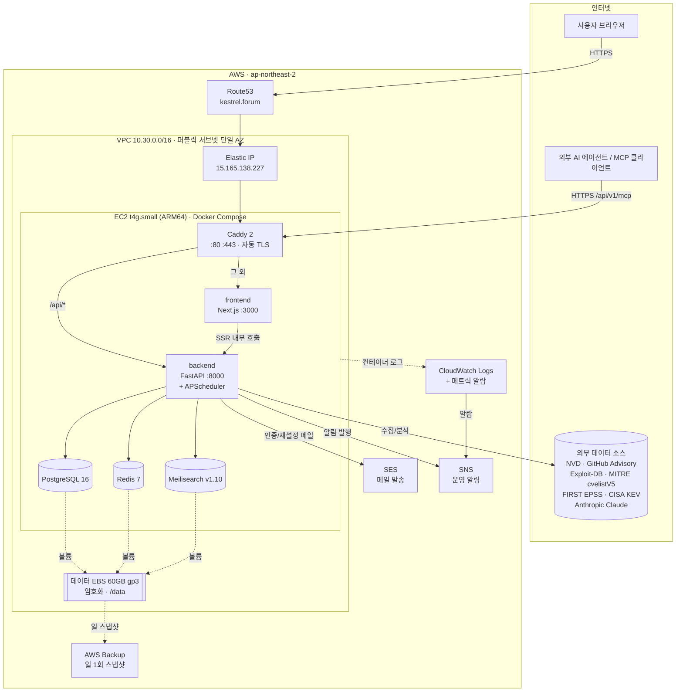
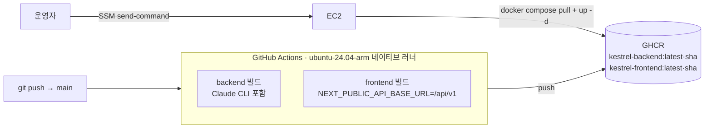

# Kestrel 실서비스 아키텍처 기술 문서

> **대상 서비스**: Kestrel — 취약점 인텔리전스 플랫폼 (CVSS · EPSS · KEV + AI 분석)
> **운영 도메인**: <https://www.kestrel.forum> (실서비스 운영 중)
> **문서 기준일**: 2026-07-08
> **작성 근거**: 배포 IaC(Terraform), 컨테이너 정의(Docker Compose), 실 AWS 리소스 조회(`ap-northeast-2`, 계정 `125051246506`), 라이브 엔드포인트 응답을 상호 대조하여 작성함.

---

## 1. 개요

Kestrel은 공개된 취약점(CVE) 정보를 다수의 권위 있는 출처에서 수집·정규화하고, 위험도 신호(CVSS 이론값, EPSS 악용 예측 확률, CISA KEV 실측 악용 여부)를 결합하여 우선순위를 제시하며, LLM 기반 분석을 부가하는 웹 서비스이다. 본 문서는 **AWS 상에서 실제 운영 중인 배포 아키텍처**를 기술한다.

핵심 설계 원칙은 **단일 EC2 호스트 + Docker Compose** 구성이다. 관리형 서비스(RDS, ElastiCache, ALB, ECS/Fargate)를 배제하고 데이터 계층까지 모두 한 인스턴스의 컨테이너로 수용하되, **데이터 영속성**(별도 EBS + AWS Backup)과 **운영 자동화**(SSM, CI 프리빌드, 자동 TLS)를 통해 낮은 비용과 낮은 운영 부담을 동시에 달성한다.

| 항목 | 값 |
|---|---|
| 클라우드 / 리전 | AWS `ap-northeast-2` (서울) |
| 컴퓨트 | EC2 `t4g.small` (2 vCPU / 2 GB, **ARM64 Graviton**) 단일 인스턴스 |
| 인스턴스 ID | `i-03e40be1e3eda7d65` (기동 2026-05-31) |
| AMI | Amazon Linux 2023 ARM64 (`ami-02eb8c6a2b1dee6b7`) |
| 고정 IP (EIP) | `15.165.138.227` |
| 오케스트레이션 | Docker Compose (호스트 systemd 유닛으로 관리) |
| 컨테이너 | `caddy · frontend · backend · postgres · redis · meilisearch` (6개) |
| 리버스 프록시 / TLS | Caddy 2 (Let's Encrypt 자동 발급·갱신) |
| DNS / 메일 | Route53 (`kestrel.forum` 호스팅 존) + SES |
| 예상 비용 | 첫 해 ~$4/월(Free Tier), 이후 ~$17/월 |

라이브 헬스 상태(`GET /api/v1/status`, 2026-07-08 조회): `api·db·redis·meili` 전부 `true`, NVD·GitHub API 키 존재, 4개 수집 파이프라인 최근 실행 모두 `success`.

---

## 2. 시스템 아키텍처 개관

**요청 경로**: 모든 트래픽은 EIP를 통해 인스턴스의 Caddy(80/443)로 들어온다. Caddy는 **동일 오리진(same-origin)** 리버스 프록시로 동작하여 `/api/*`·`/docs`·`/openapi.json` 요청은 backend(FastAPI)로, 그 외 모든 경로는 frontend(Next.js)로 라우팅한다. 이 구조 덕분에 브라우저 관점에서 API는 상대 경로 `/api/v1`이며 별도의 CORS·프리플라이트가 사실상 불필요하다.

---

## 3. AWS 인프라 구성

전체 인프라는 Terraform(`infra/ec2/`)으로 코드화되어 있으며, 아래는 실 배포 리소스와 대조하여 확인한 구성이다.

### 3.1 네트워크

| 리소스 | 구성 | 비고 |
|---|---|---|
| VPC | `10.30.0.0/16` | DNS 호스트네임/해석 활성화 |
| 서브넷 | `10.30.1.0/24` (단일 AZ `ap-northeast-2a`, 퍼블릭) | `map_public_ip_on_launch` |
| 인터넷 게이트웨이 | VPC 연결 | 아웃바운드/인바운드 인터넷 |
| 라우트 테이블 | `0.0.0.0/0 → IGW` | NAT 게이트웨이 **없음**(비용 절감) |
| Elastic IP | `15.165.138.227` | 인스턴스 재기동·교체에도 IP·인증서 유지 |

**관리형 계층 부재**가 이 아키텍처의 핵심 결정이다. RDS·ElastiCache·ALB·NAT를 두지 않고, 데이터·캐시·검색을 모두 인스턴스 내 컨테이너로 수용한다. 트래픽·데이터 규모가 단일 소형 인스턴스로 감당 가능한 수준이라는 전제에서, 관리형 서비스 대비 비용을 한 자릿수 달러/월로 낮춘다.

### 3.2 보안 그룹 (호스트 방화벽)

| 방향 | 포트 | 소스/대상 | 목적 |
|---|---|---|---|
| Inbound | 80/tcp | `0.0.0.0/0` | HTTP → HTTPS 리다이렉트 + ACME(Let's Encrypt) HTTP-01 챌린지 |
| Inbound | 443/tcp | `0.0.0.0/0` | Caddy TLS |
| Inbound | 22/tcp | (닫힘) | SSH 미개방 — **SSM Session Manager로 대체** |
| Outbound | 전체 | `0.0.0.0/0` | 업스트림 API·Docker Hub·ACME |

DB(5432)·Redis(6379)·Meilisearch(7700)는 **보안 그룹에서 열려 있지 않을 뿐 아니라, Docker Compose 오버라이드에서 호스트 포트 매핑 자체를 제거**(`ports: !reset []`)하여 컨테이너 내부 네트워크로만 통신한다. 특히 Redis는 비밀번호가 없으므로 이 이중 차단이 중요하다.

### 3.3 컴퓨트 및 스토리지

- **EC2 `t4g.small` (ARM64 Graviton)**: 부트 디스크는 8GB gp3(암호화)로 작게 유지하고, Docker 데이터 루트를 별도 데이터 EBS(`/data/docker`)로 이동시켜 모든 컨테이너 볼륨이 데이터 EBS에 적재되도록 한다.
- **데이터 EBS 60GB gp3(암호화)**: PostgreSQL 데이터, Redis AOF, Meilisearch 인덱스, Claude 자격증명, MITRE cvelistV5 저장소(~5GB) 등 **모든 영속 데이터**를 보관한다. 인스턴스와 수명주기를 분리(`/dev/sdb` attach)하여, 인스턴스가 죽거나 교체되어도 detach → 신규 인스턴스 attach만으로 데이터가 그대로 복구된다. cloud-init(`user_data`)이 재부팅 시 자동으로 마운트·`docker compose up`을 수행한다.
- **스왑 2GB**: 2GB RAM 인스턴스에서 (과거) 프런트엔드 빌드 및 대량 집계 시 OOM을 방지하기 위해 부트스트랩이 스왑 파일을 구성한다.
- **2GB 박스에 맞춘 PostgreSQL 튜닝**: `shared_buffers=384MB`, `effective_cache_size=1GB`, `work_mem=16MB`, `jit=off`, gp3 가정(`random_page_cost=1.1`), 공격적 autovacuum(수십만 행 규모 수집 후 통계 stale로 인한 seq-scan 방지). 소형 단일 호스트에서 수십만 건 규모의 취약점 테이블 집계를 감당하기 위한 조정이다.

### 3.4 DNS · 메일 (Route53 + SES)

- **Route53 호스팅 존** `kestrel.forum` (`Z02665902DD63FB3IU0OZ`): apex(`kestrel.forum`)와 `www.kestrel.forum` A 레코드가 EIP를 가리킨다. Caddy가 apex → `www`로 301 정규화하여 `www`를 유일한 서비스 호스트로 사용한다.
- **SES (도메인 아이덴티티 `kestrel.forum`)**: 회원가입 인증·비밀번호 재설정 메일 발송에 사용. 인스턴스 IAM 역할에 `ses:SendEmail` 권한을 부여하여 **정적 키 없이** 역할 자격증명으로 발송한다. 라이브 조회 기준 아래 요소가 실제 적용되어 운영 중이다.

| SES 구성 요소 | 상태 (라이브 확인) | 목적 |
|---|---|---|
| 프로덕션 액세스 | `ProductionAccessEnabled=true`, `SendingEnabled=true`, `Enforcement=HEALTHY` | 초기 샌드박스 해제 — 검증되지 않은 임의 사용자에게 발송 가능 |
| 발송 한도 | `Max24HourSend=50,000`, `MaxSendRate=14/s` | 프로덕션 승격에 따른 상향된 쿼터 |
| 도메인 검증 | `_amazonses` TXT, `VerifiedForSendingStatus=true` | 도메인 소유 검증 |
| DKIM 서명 | CNAME 3개, `DkimStatus=SUCCESS`, `SigningEnabled=true` | 서명으로 위변조 방지·스팸 판정 회피 |
| **커스텀 MAIL FROM** | `mail.kestrel.forum` (`Status=SUCCESS`) | Return-Path를 서비스 도메인으로 정렬 → **SPF 정렬(alignment)** 확보 |
| **SPF** | `mail.kestrel.forum` TXT: `v=spf1 include:amazonses.com ~all` | 발신 서버 인가 |
| **MX (피드백)** | `mail.kestrel.forum` MX: `10 feedback-smtp.ap-northeast-2.amazonses.com` | 바운스/컴플레인 피드백 수신 |
| **DMARC** | `_dmarc.kestrel.forum` TXT: `v=DMARC1; p=none;` | 정렬 모니터링(현재 관측 단계, 격리/거부 미적용) |
| 계정 억제 목록 | `SuppressedReasons=[BOUNCE, COMPLAINT]` | 재발송 방지로 평판 보호 |
| 피드백 포워딩 | `FeedbackForwardingStatus=true` | 바운스/컴플레인 알림 수신 |

SES 프로덕션 승격 이후 **DKIM + 커스텀 MAIL FROM + SPF + DMARC**를 결합하여 도메인 정렬 기반의 전달성(deliverability)을 확보한 것이 초기 구성 대비 실질적 개선점이다. DMARC는 현재 `p=none`(모니터링)으로, 정렬 리포트를 관찰한 뒤 `quarantine`/`reject`로 강화할 여지가 있다.

> **IaC 반영 현황**: 위 표의 **커스텀 MAIL FROM·SPF·MX·DMARC 레코드**와 §8의 **SES 평판 알람**(`kestrel-ses-bounce-rate`·`kestrel-ses-complaint-rate`)은 운영 중 콘솔로 적용한 뒤, 라이브를 기준으로 Terraform에 역코드화하여 관리 대상으로 편입하였다(`infra/ec2/ses_deliverability.tf`, `cloudwatch.tf`). 기존 리소스를 `terraform import`로 state에 흡수하여 라이브를 변경하지 않았으며, `terraform plan` 결과 무변경(`No changes. Your infrastructure matches the configuration.`)으로 코드-라이브 정합을 확인하였다. 다만 **SES 프로덕션 액세스 승격**과 **계정 억제 목록(BOUNCE/COMPLAINT)**은 계정 레벨 설정/서포트 요청이라 이 스택의 Terraform 리소스로는 표현되지 않으며, 라이브 상태(`ProductionAccessEnabled=true`)로 관리된다.

### 3.5 백업 (AWS Backup)

| 항목 | 값 |
|---|---|
| 백업 볼트 | `kestrel-prod-vault` (현재 복구 지점 7개 보유) |
| 백업 플랜 | `kestrel-prod-daily` |
| 스케줄 | `cron(0 18 * * ? *)` — 매일 18:00 UTC(KST 03:00) |
| 보존 | 7일 |
| 대상 | 데이터 EBS 볼륨(`vol-...`) |
| 확인된 실 스냅샷 | 2026-07-06/07/08 각 `COMPLETED`, ~60GB |

전용 IAM 역할(`AWSBackupServiceRolePolicyForBackup`)로 데이터 EBS를 일 1회 스냅샷하여, 인스턴스 장애·데이터 손상 시 복구 지점을 제공한다.

### 3.6 IAM (역할 기반, 정적 키 제로)

인스턴스는 IAM **인스턴스 프로파일**을 통해 세 종류 권한을 역할 자격증명으로 사용한다. 애플리케이션·데몬 어디에도 정적 액세스 키를 두지 않는다.

| 부여 권한 | 사용처 |
|---|---|
| `AmazonSSMManagedInstanceCore` | SSM Session Manager 셸 접속(SSH 대체) 및 원격 명령 |
| `logs:CreateLogStream/PutLogEvents/...` | Docker `awslogs` 드라이버 → CloudWatch Logs 전송 |
| `sns:Publish` | backend가 운영 알림(신고 등)을 SNS로 발행 |
| `ses:SendEmail/SendRawEmail/GetSendQuota` | 인증·재설정 메일 발송 |

배포용 IAM 사용자(`kestrel-tf-deploy`)는 별도로 존재하며 로컬에서 Terraform 및 SSM 원격 배포(`AWS_PROFILE=kestrel-deploy`)에 사용한다.

---

## 4. 애플리케이션 스택 (컨테이너)

인스턴스 위 Docker Compose 스택은 6개 컨테이너로 구성된다. 기본 `docker-compose.yml`에 운영 전용 `docker-compose.override.yml`(cloud-init 생성)이 겹쳐져 Caddy 추가 및 내부 포트 비노출을 적용한다.

| 컨테이너 | 이미지 | 역할 | 영속 볼륨 |
|---|---|---|---|
| **caddy** | `caddy:2-alpine` | TLS 종단·리버스 프록시·보안 헤더·gzip/zstd | `caddy_data`(인증서), `caddy_config` |
| **frontend** | `ghcr.io/mimonimo/kestrel-frontend` | Next.js(React/TS/Tailwind/TanStack Query) SSR·UI | — |
| **backend** | `ghcr.io/mimonimo/kestrel-backend` | FastAPI(Python 3.12) API + APScheduler + AI 분석 | `claude_credentials`, `mitre_cvelist` |
| **postgres** | `postgres:16-alpine` | 주 데이터 저장소 | `postgres_data` |
| **redis** | `redis:7-alpine` | 캐시·집계 스냅샷·참고자료 프리뷰 캐시 | `redis_data` |
| **meilisearch** | `getmeili/meilisearch:v1.10` | 전문 검색 인덱스 | `meili_data` |

- **Caddy 라우팅(same-origin)**: `@api { path /api/* /docs /openapi.json }` → `backend:8000`, 그 외 → `frontend:3000`. HSTS·`X-Content-Type-Options`·`X-Frame-Options`·`Referrer-Policy` 보안 헤더를 주입하고 `Server` 헤더를 제거한다. 인증서는 Let's Encrypt에서 자동 발급·갱신된다(운영 확인: `www.kestrel.forum` HTTP/2 200, HSTS·보안 헤더 응답, `via: Caddy`).
- **frontend↔backend 이중 경로**: 브라우저는 상대 경로 `/api/v1`(빌드 타임에 `NEXT_PUBLIC_API_BASE_URL`로 번들에 고정), Next.js 서버사이드 렌더링은 컨테이너 네트워크 내부 주소 `http://backend:8000/api/v1`(`INTERNAL_API_BASE_URL`)를 사용한다.
- **backend 기동 시퀀스**: `alembic upgrade head`(스키마 마이그레이션) → `uvicorn`. postgres·redis는 `healthcheck` 통과를 조건으로 의존한다.
- **환경/시크릿**: cloud-init이 `chmod 600 .env`로 `ENV=production`·`DEBUG=false`·무작위 `JWT_SECRET`(`openssl rand`)·DB/Meili 비밀번호를 호스트에 생성한다. NVD/GitHub 수집 키는 `.env`가 아니라 **관리자 설정 화면(DB `AppSettings`)**에서 관리하며 스케줄러가 DB 값을 우선한다.

---

## 5. 데이터 수집 파이프라인

backend 내부의 **APScheduler**(단일 프로세스, 별도 워커·큐 없음)가 다출처 수집·보강·집계 작업을 주기 실행한다. 기동 시 소스별로 시차(stagger)를 두어 레이트 리밋 충돌과 부팅 메모리 경합을 회피한다.

### 5.1 외부 데이터 소스

| 소스 | 엔드포인트 | 제공 신호 |
|---|---|---|
| **NVD** | `nvd.nist.gov/developers/vulnerabilities` | CVE 기본 정보, CVSS |
| **MITRE cvelistV5** | `github.com/CVEProject/cvelistV5`(git, ~5GB) | CVE 원본 레코드(권위 소스) |
| **GitHub Advisory** | `api.github.com/graphql` | GHSA 권고, 영향 패키지 |
| **Exploit-DB** | (익스플로잇 카탈로그) | 공개 익스플로잇 존재 여부 |
| **FIRST EPSS** | `epss.empiricalsecurity.com/epss_scores-current.csv.gz` | 악용 **예측** 확률(일간, ~5MB) |
| **CISA KEV** | KEV 카탈로그 | **실측** 악용(Known Exploited) 여부 |
| **Anthropic Claude** | `api.anthropic.com` / Claude Code CLI | LLM 기반 취약점 분석 |

### 5.2 스케줄 (실제 등록된 잡)

| 작업 | 주기 | 부팅 후 최초 |
|---|---|---|
| NVD 수집 | 설정값 간격 | +30s |
| GitHub Advisory 수집 | 설정값 간격 | +90s |
| Exploit-DB 수집 | 설정값 간격 | +150s |
| MITRE 델타 수집(git 변경분만 walk) | 설정값 간격 | +210s |
| KEV 갱신 | 1시간 | +60s |
| EPSS 갱신(무거운 일간 배치) | 24시간 | +600s |
| **집계 스냅샷** 사전계산(→Redis) | 10분 | +45s |
| 검색 인덱스 정합성 점검(PG↔Meili) | 6시간 | +300s |

- **집계 스냅샷 캐시**가 성능 설계의 핵심이다. 수십만 행 규모 취약점 테이블에 대한 무거운 facet/대시보드 집계를 10분마다 미리 계산해 Redis에 저장하고, API는 스냅샷을 즉시 반환한다. 매 요청마다 수십 초 걸리던 집계를 제거한다.
- **MITRE 초기 백필**은 온라인 잡이 아니라 관리자 엔드포인트(`/admin/mitre-backfill`)로 대역 외 수행하고, 이후 스케줄러는 git 델타(최근 변경 파일)만 순회하여 각 틱을 가볍게 유지한다.
- 라이브 확인(2026-07-08): NVD·Exploit-DB·GitHub Advisory·MITRE 최근 실행 모두 `status: success`.

### 5.3 AI 분석 (BYOA)

서버 측 자동 분석 배치는 두지 않는다. Claude Code CLI를 backend 이미지에 내장하고, 대시보드의 "Claude 로그인" 흐름이 컨테이너 내부에서 `claude setup-token`을 실행해 OAuth 자격증명(`~/.claude/.credentials.json`)을 `claude_credentials` 볼륨에 영속화한다. 분석은 사용자/외부 에이전트가 트리거하는 온디맨드 방식이며, 외부 AI 에이전트는 **Agent API 토큰** 또는 `/api/v1/mcp`(읽기 전용 MCP 서버)를 통해 데이터를 조회하고 분석을 게시·토론할 수 있다.

---

## 6. CI/CD 및 배포 파이프라인

**약한 인스턴스에서 빌드하지 않는다**는 원칙 아래, 이미지 빌드를 GitHub Actions로 이관하고 EC2는 pull만 한다.

- **네이티브 ARM64 빌드**: 운영 인스턴스가 arm64 단일 호스트이므로 러너도 `ubuntu-24.04-arm`(public 레포 무료)에서 `linux/arm64`만 빌드한다. QEMU 교차 빌드는 Next/SWC 프런트엔드가 1~2시간씩 소요되어 사용하지 않는다.
- **레지스트리**: GHCR public 패키지(`ghcr.io/mimonimo/kestrel-{backend,frontend}`) `:latest` + `:<sha>`. public이므로 EC2는 인증 없이 pull 가능.
- **배포 = pull만**: SSM Session Manager(SSH 없이)로 `cd /opt/kestrel && docker compose pull backend frontend && docker compose up -d`. 호스트 재빌드는 OOM 위험으로 금지. cloud-init의 systemd 유닛도 `pull → up -d`를 우선하고 실패 시에만 최후 수단으로 `--build`.
- **트리거**: `backend/**`·`frontend/**`·워크플로 변경 push 또는 수동 `workflow_dispatch`.

---

## 7. 보안 설계 요약

| 계층 | 통제 |
|---|---|
| 네트워크 | 80/443만 인바운드 개방, SSH 미개방(SSM 대체), 데이터/캐시/검색 포트 컨테이너 내부 전용(호스트 매핑 제거) |
| 접근 | 정적 키 제로 — 모든 AWS 상호작용이 IAM 인스턴스 역할 자격증명 기반; 셸 접근은 SSM |
| 전송 | 전 구간 HTTPS(Let's Encrypt 자동 TLS), HSTS 1년, HTTP→HTTPS 강제 리다이렉트 |
| 애플리케이션 | 보안 헤더(`X-Frame-Options`/`X-Content-Type-Options`/`Referrer-Policy`), `Server` 헤더 제거; `ENV=production`에서 쿠키 `Secure` 플래그·디버그 오프·기본 시크릿 가드 활성 |
| 인증 | JWT(무작위 64자 시크릿, 12h 만료), 부트스트랩 관리자 이메일 화이트리스트 |
| 데이터 | EBS 암호화(부트·데이터), 일 1회 AWS Backup(7일 보존) |
| 메일 신뢰성 | SES 프로덕션 + DKIM 서명 + 커스텀 MAIL FROM(SPF 정렬) + DMARC(`p=none`) + 계정 억제 목록, 바운스·컴플레인 평판 CloudWatch 알람 |

---

## 8. 관측성 및 운영

- **로그**: 호스트 Docker 데몬이 `awslogs` 드라이버(비차단 모드)로 **모든 컨테이너 로그**를 CloudWatch Logs 그룹 `/kestrel/prod/containers`(14일 보존)로 전송한다.
- **에러 알람**: 메트릭 필터가 `Traceback (most recent call last)`·`CRITICAL` 라인만 카운트(일반 `ERROR`는 노이즈로 제외)하여 커스텀 지표 `Kestrel/prod:AppErrors`를 생성. 알람은 **5분 구간당 3건 이상이 연속 3구간(15분)** 지속될 때만 발화(단발성 억제)하여 SNS로 통지한다. 현재 상태 `OK`.
- **알림 채널**: SNS 토픽 `kestrel-prod-alerts` → 운영자 이메일 구독(확인 완료). backend의 사용자 신고 등 애플리케이션 이벤트도 동일 토픽으로 발행.
- **애플리케이션 관측성**: OpenTelemetry 계측 및 Sentry(DSN 설정 시 활성, 미설정 시 no-op) 연동 지점 보유.
- **헬스 체크**: `GET /api/v1/status`가 api·db·redis·meili 상태와 최근 수집 이력을, `GET /api/v1/health`가 라이브니스를 반환.
- **일상 운영**: 평시 SSH·수동 개입 없이 SSM으로만 접근. 인스턴스 교체 시 데이터 EBS re-attach + cloud-init 자동 복구.

---

## 9. 비용 구조

| 구성 | 비용(대략) |
|---|---|
| 첫 해(t4g.small Free Tier 750h/월 적용) | ~$4/월 |
| 이후(정상 요금) | ~$17/월 |

주요 원가는 EC2·EBS(부트 8GB + 데이터 60GB gp3)·EIP·소량 데이터 전송이며, CloudWatch 로그(월 수십 MB)·알람·SNS·Backup 스냅샷은 각각 센트 단위이다. 관리형 DB/캐시/로드밸런서/NAT를 배제한 것이 저비용의 결정적 요인이다.

---

## 10. 설계 결정 및 트레이드오프

| 결정 | 근거 | 트레이드오프 |
|---|---|---|
| 단일 EC2 + Compose (vs ECS Fargate 풀스택) | 비용 한 자릿수 달러/월, 운영 단순성. 리포지토리에 ECS 대안(`infra/legacy-ecs`)도 존재하나 미사용 | 수직 확장 한계, 단일 AZ·단일 인스턴스(가용성 SLA 낮음) |
| 관리형 서비스 배제(RDS/ElastiCache/ALB/NAT 없음) | 비용·운영 부담 최소화 | 백업·튜닝·패치를 자체 부담(EBS 스냅샷+수동 PG 튜닝으로 보완) |
| 데이터 EBS 분리 + AWS Backup | 인스턴스와 데이터 수명주기 분리 → 교체·복구 용이 | 다중 AZ 이중화는 아님(스냅샷 복원 기반) |
| ARM64(Graviton) 네이티브 | 가격/성능 우수, 러너 무료 | amd64 소비자 없음(단일 호스트라 무관), 교차 빌드 회피 필요 |
| CI 프리빌드 + EC2 pull만 | 2GB 인스턴스 빌드 OOM 회피, 배포 시간 단축 | 배포가 GHCR·CI 가용성에 의존 |
| SSM Only(SSH 미개방) | 공격 표면 축소, 키 관리 불필요 | 콘솔/CLI 의존 |
| Caddy same-origin 프록시 | CORS 제거, 자동 TLS, 단순 라우팅 | 프록시 단일 장애점(컨테이너 재시작으로 완화) |

---

## 부록 A. 실 리소스 인벤토리 (2026-07-08 조회)

| 리소스 | 식별자 |
|---|---|
| AWS 계정 / 리전 | `125051246506` / `ap-northeast-2` |
| EC2 인스턴스 | `i-03e40be1e3eda7d65` (`t4g.small`, arm64, `ap-northeast-2a`) |
| AMI | `ami-02eb8c6a2b1dee6b7` (AL2023 ARM64) |
| Elastic IP | `15.165.138.227` |
| EBS (부트) | `vol-0698b9f2b7b0c2ea7` (8GB gp3, 암호화) |
| EBS (데이터) | `vol-0ccac994eb2c5edef` (60GB gp3, 암호화) |
| Route53 존 | `kestrel.forum` → `Z02665902DD63FB3IU0OZ` |
| SES 아이덴티티 | `kestrel.forum` (검증 Success, 프로덕션 액세스) |
| Backup 볼트/플랜 | `kestrel-prod-vault` / `kestrel-prod-daily`(복구지점 7) |
| CloudWatch 로그그룹 | `/kestrel/prod/containers` (14일) |
| CloudWatch 알람 | `kestrel-prod-app-errors`, `kestrel-ses-bounce-rate`, `kestrel-ses-complaint-rate` (전부 OK) |
| SNS 토픽 | `arn:aws:sns:ap-northeast-2:125051246506:kestrel-prod-alerts` |

## 부록 B. 기술 스택

- **Frontend**: Next.js · React · TypeScript · Tailwind CSS · TanStack Query
- **Backend**: FastAPI · Python 3.12 · SQLAlchemy · Pydantic · APScheduler · Alembic
- **데이터/인프라**: PostgreSQL 16 · Redis 7 · Meilisearch v1.10 · Docker Compose · Caddy 2
- **AI/관측성**: Anthropic Claude(Claude Code CLI, MCP) · OpenTelemetry · Sentry
- **클라우드**: EC2(Graviton/ARM64) · EBS · EIP · Route53 · SES · SNS · CloudWatch · AWS Backup · IAM · SSM
- **CI/CD**: GitHub Actions(ARM64 네이티브 러너) · GHCR

---

*본 문서는 배포 IaC·컨테이너 정의·실 AWS 리소스 조회·라이브 엔드포인트 응답을 상호 검증하여 작성되었다. IaC와 라이브 상태 간 차이가 확인된 항목(§3.4)은 명시적으로 표기하였다.*
