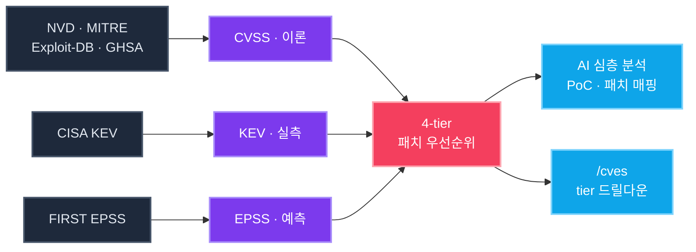

<div align="center">

<br/>

```
   ╦╔═┌─┐┌─┐┌┬┐┬─┐┌─┐┬
   ╠╩╗├┤ └─┐ │ ├┬┘├┤ │
   ╩ ╩└─┘└─┘ ┴ ┴└─└─┘┴─┘
```

### **CVE 인텔리전스 플랫폼 — 무엇부터 패치할지 알려드립니다**

<br/>

[](./LICENSE)
[](https://nextjs.org/)
[](https://fastapi.tiangolo.com/)
[](https://www.postgresql.org/)
[](https://www.anthropic.com/)

</div>

---

> **모든 것을 동시에 막을 수는 없습니다.**
> 심각도가 아니라 *실제 위협*을 기준으로 — `CVSS` 이론 · `EPSS` 예측 · `KEV` 실측 세 신호로 본 패치 우선순위.

```bash
docker compose up -d --build
```

Frontend → <http://localhost:3000>  ·  Backend → <http://localhost:8000>

---

## 데이터 흐름



---

## 패치 우선순위

| Tier | 기준 | 조치 |
|:---:|---|---|
| **①** | `KEV 등재` | 실측 악용 — **최우선 패치** |
| **②** | `EPSS 상위` + 외부 접점 | 30일 내 악용 예측 — **즉시 조치** |
| **③** | `CVSS 중간` + EPSS 높음 | 이론 낮아도 가능성 — **앞당겨 조치** |
| **④** | `CVSS 높음` + EPSS 낮음 | 이론 심각도만 — **계획된 주기** |

행 클릭 시 `/cves?priority=<tier>` 전체 목록으로 드릴다운.

---

## 기능

| | |
|---|---|
| **수집** | NVD · MITRE · Exploit-DB · GitHub Advisory · CISA KEV · FIRST EPSS |
| **검색** | Meilisearch + PG `tsvector` 폴백, 16 vuln-type × 18 도메인 chip |
| **위젯** | 분포 · 추세 · 영향 벤더 · CVSS 히스토그램 · 최근 Critical · 우선순위 매트릭스 |
| **AI 분석** | Claude 연동, PoC + 패치 매핑, Follow-up Q&A, CVE 패턴 비교, Markdown 리포트 |
| **협업** | 자산 등록 · 즐겨찾기 · 대응 상태 · 익명 댓글 |

---

## AI 모델

| 모델 | 응답 | 권장 |
|---|:---:|---|
| `Haiku 4.5` | 10 – 15초 | 일상 검토 |
| `Sonnet 4.6` <sub>(기본)</sub> | 1 – 2분 | 깊이 있는 PoC + 완화 전략 |
| `Opus 4.7` | 2 – 4분 | 복잡한 다단 익스플로잇 |

---

## API

```bash
curl 'localhost:8000/api/v1/search?priority=kev&pageSize=20'
curl 'localhost:8000/api/v1/dashboard/insights' | jq
curl -X POST 'localhost:8000/api/v1/cves/CVE-2021-44228/analyze'
```

전체 스펙 — <http://localhost:8000/docs>

---

## 개발

```bash
docker compose up -d postgres redis meilisearch
cd backend && uv sync && uv run uvicorn app.main:app --reload
cd frontend && npm install && npm run dev
```

---

## 라이선스

[MIT](./LICENSE)

<br/>

<div align="center">

<sub>Built with `Next.js` · `FastAPI` · `PostgreSQL` · `Meilisearch` · `Claude`</sub>

</div>
