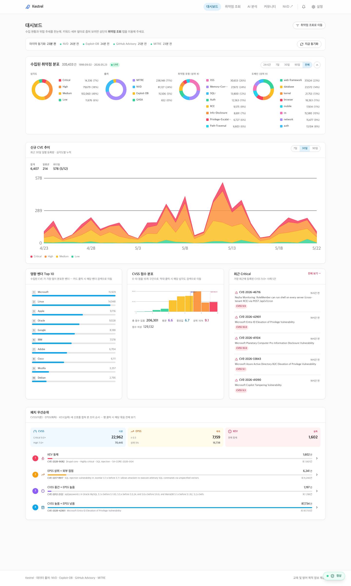
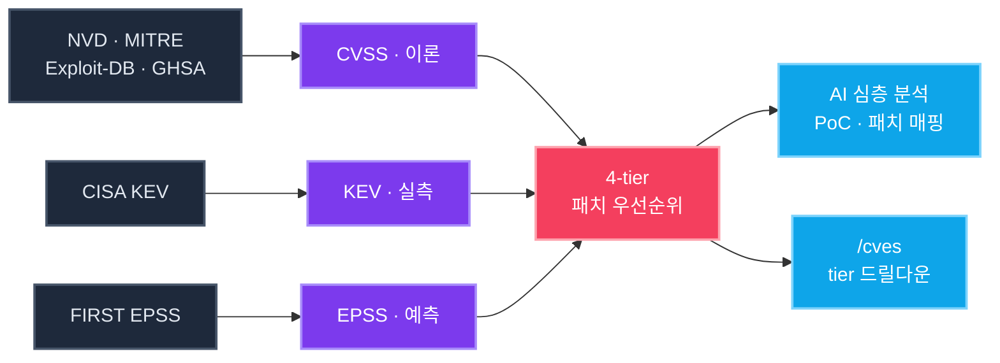
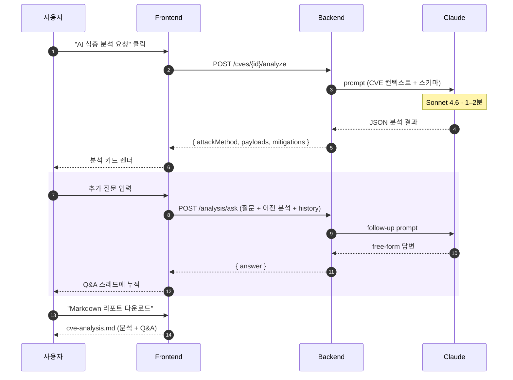
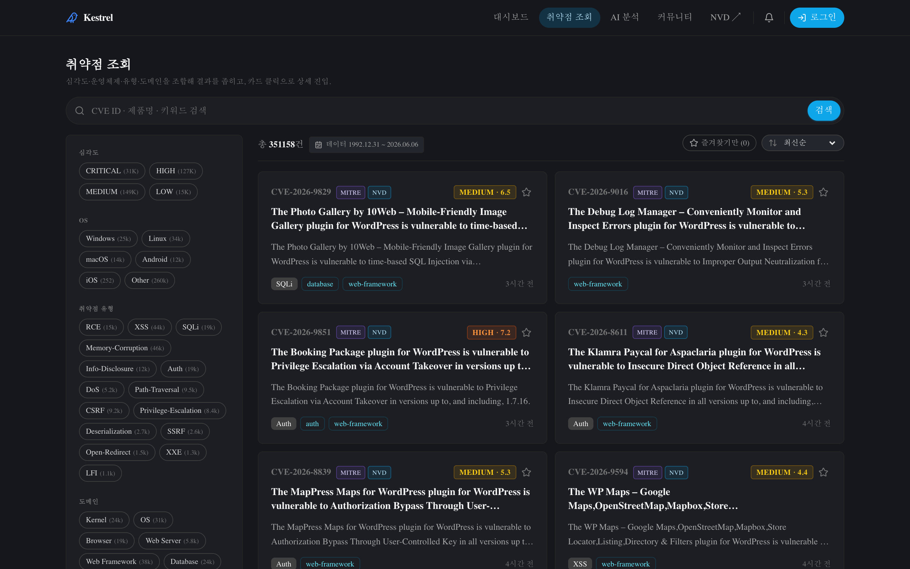
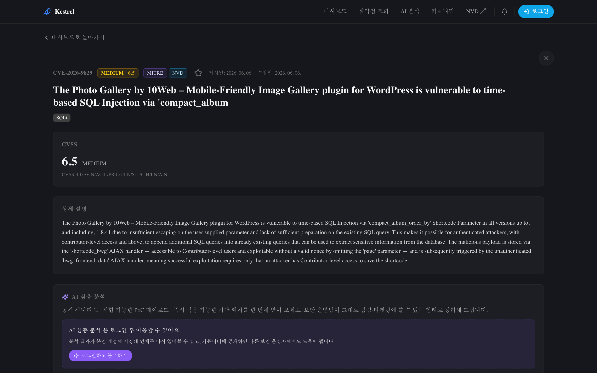
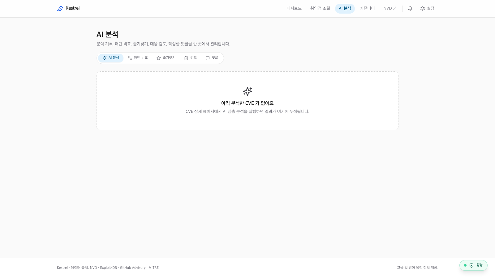
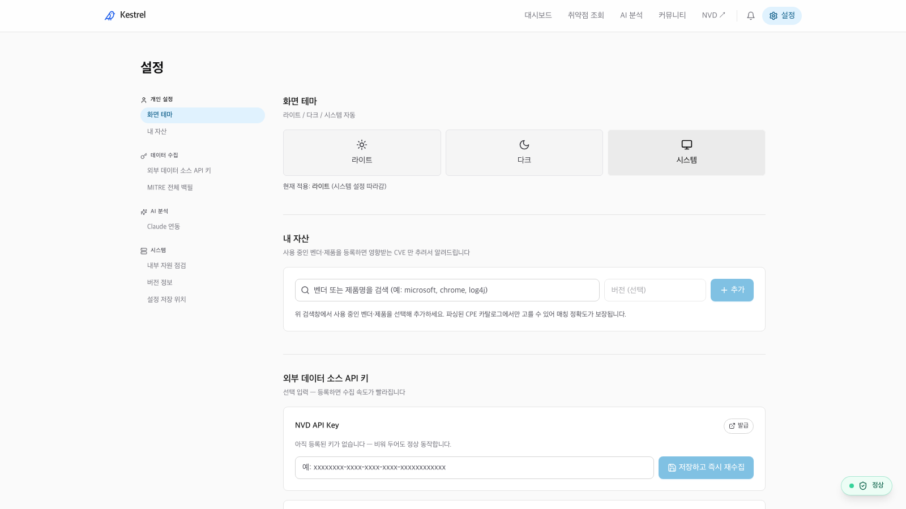

<div align="center">

<br/>

# **`Kestrel`**

### 어디서부터 패치할지, AI 가 답합니다

<sub>**`CVSS`** 이론&nbsp;&nbsp;·&nbsp;&nbsp;**`EPSS`** 예측&nbsp;&nbsp;·&nbsp;&nbsp;**`KEV`** 실측 — 세 신호로 본 진짜 우선순위</sub>

<br/>



<br/>
<br/>

[](#빠른-시작)
&nbsp;
[](#ai-분석-흐름)
&nbsp;
[](#데이터-흐름)
&nbsp;
[](./LICENSE)

</div>

---

> **모든 것을 동시에 막을 수는 없습니다.**
> 심각도가 아니라 _실제 위협_을 기준으로.

<br/>

## 데이터 흐름



<br/>

## AI 분석 흐름



<br/>

## 페이지

<table>
<tr>
<td width="50%" align="center">

#### `/cves` 취약점 조회


</td>
<td width="50%" align="center">

#### `/cve/{id}` 상세 + AI 분석


</td>
</tr>
<tr>
<td width="50%" align="center">

#### `/analysis` AI 작업 공간


</td>
<td width="50%" align="center">

#### `/settings` 설정


</td>
</tr>
</table>

<br/>

## 빠른 시작

```bash
git clone https://github.com/mimonimo/Kestrel.git
cd Kestrel
docker compose up -d --build
```

Frontend → <http://localhost:3000>  ·  Backend → <http://localhost:8000>

<br/>

<div align="center">

[MIT](./LICENSE) · <sub>Built with `Next.js` · `FastAPI` · `PostgreSQL` · `Claude`</sub>

</div>
