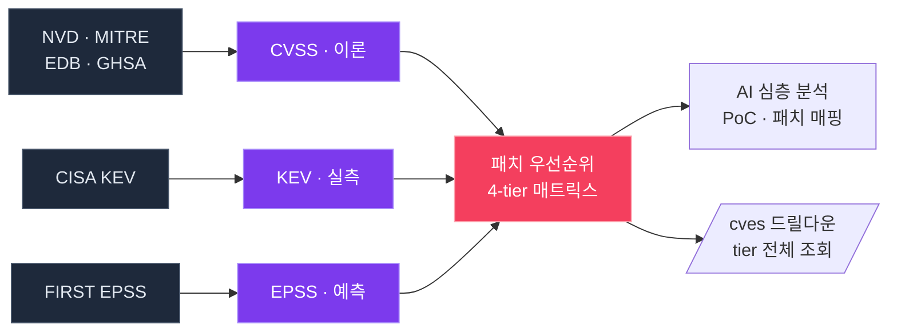

<div align="center">

<br/>

# `Kestrel`

### 무엇부터 패치할지 알려주는 CVE 인텔리전스 플랫폼

> 모든 것을 동시에 막을 수는 없습니다.
> **심각도가 아니라 실제 위협**을 기준으로.

<br/>

[](./LICENSE)
[](https://nextjs.org/)
[](https://fastapi.tiangolo.com/)
[](https://www.postgresql.org/)
[](https://www.meilisearch.com/)
[](https://www.anthropic.com/)
[](https://docs.docker.com/compose/)

<br/>

[빠른 시작](#-빠른-시작) ·
[핵심 가치](#-핵심-가치) ·
[기능](#-기능) ·
[API](#-api) ·
[개발](#-개발-환경) ·
[라이선스](#-라이선스)

</div>

---

## ▸ 세 가지 위협 신호

<table>
<tr>
<td width="33%" align="center">

### `CVSS`
**이론적 심각도**

이 취약점은 *얼마나 심각한가*

`Score 0 – 10`

<sub>출처: NVD · MITRE</sub>

</td>
<td width="33%" align="center">

### `EPSS`
**예측 확률**

실제로 *악용될 가능성이 큰가*

`Probability 0 – 1`

<sub>출처: FIRST.org (일 1회)</sub>

</td>
<td width="34%" align="center">

### `KEV`
**관측된 사실**

이미 *실제로 악용되고 있는가*

`CISA KEV Catalog`

<sub>출처: CISA (시간 단위)</sub>

</td>
</tr>
</table>

---

## ▸ 빠른 시작

```bash
git clone https://github.com/mimonimo/Kestrel.git
cd Kestrel
docker compose up -d --build
```

<table>
<tr>
<td>

**Frontend** → <http://localhost:3000>

</td>
<td>

**Backend** → <http://localhost:8000/api/v1/health>

</td>
</tr>
</table>

<sub>사전 요구사항: Docker 24+ · 4GB RAM · 10GB 디스크 (MITRE 백필 시 +5GB)</sub>

---

## ▸ 핵심 가치



---

## ▸ 패치 우선순위 매트릭스

<table>
<tr>
<th align="center" width="80">Tier</th>
<th>기준</th>
<th>조치</th>
</tr>
<tr>
<td align="center">

### `①`
<sub>**rose**</sub>

</td>
<td><b>KEV 등재</b></td>
<td>실측된 악용 — <b>최우선 패치</b></td>
</tr>
<tr>
<td align="center">

### `②`
<sub>**amber**</sub>

</td>
<td><b>EPSS 상위</b> + 외부 접점</td>
<td>30일 내 악용 예측 — <b>즉시 조치</b></td>
</tr>
<tr>
<td align="center">

### `③`
<sub>**violet**</sub>

</td>
<td><b>CVSS 중간</b> + EPSS 높음</td>
<td>이론은 낮아도 터질 가능성 — <b>앞당겨 조치</b></td>
</tr>
<tr>
<td align="center">

### `④`
<sub>**sky**</sub>

</td>
<td><b>CVSS 높음</b> + EPSS 낮음</td>
<td>이론 심각도만 — <b>계획된 패치 주기</b></td>
</tr>
</table>

<sub>각 tier는 클릭 한 번으로 `/cves?priority=<tier>` 전체 목록으로 드릴다운</sub>

---

## ▸ 기능

<table>
<tr>
<td width="50%" valign="top">

### `데이터 수집`

| 출처 | 갱신 |
|---|---|
| NVD 2.0 | 분 단위 증분 |
| MITRE cvelistV5 | 30분 git 델타 |
| Exploit-DB | 시간 |
| GitHub Advisory | 시간 |
| CISA KEV | 시간 |
| FIRST EPSS | 일 1회 |

</td>
<td width="50%" valign="top">

### `대시보드 위젯`

- **취약점 분포** — 4축 파이 + cross-filter
- **신규 CVE 추이** — stacked area 7/30/90일
- **영향 벤더 Top 10** — 가로 막대
- **CVSS 분포** — 10-bin 히스토그램 + 평균/중앙값/p90
- **최근 Critical** — 9.0+ 카드
- **패치 우선순위** — 4-tier 매트릭스

</td>
</tr>
<tr>
<td valign="top">

### `검색 & 필터`

- Meilisearch + PG `tsvector` 폴백
- 부분 CVE-ID 매칭 (`"44228"`)
- 16 vuln-type × 18 도메인 chip
- 정렬 4종 + 기간 프리셋
- URL 동기화 (`?priority=kev`)

</td>
<td valign="top">

### `AI 분석`

- 심층 분석 (PoC + 패치 매핑)
- Follow-up Q&A thread
- CVE 2-5개 패턴 비교
- Markdown 리포트 다운로드
- 새로고침에도 진행 상태 영속

</td>
</tr>
</table>

---

## ▸ 화면

<table>
<tr>
<td align="center" width="20%">
<a href="#">

#### `/`
**대시보드**

</a>
<sub>시각화 + 우선순위</sub>
</td>
<td align="center" width="20%">
<a href="#">

#### `/cves`
**취약점 조회**

</a>
<sub>검색 · 필터 · 리스트</sub>
</td>
<td align="center" width="20%">
<a href="#">

#### `/cve/{id}`
**상세 + AI**

</a>
<sub>분석 · 대응 · 댓글</sub>
</td>
<td align="center" width="20%">
<a href="#">

#### `/analysis`
**AI 작업 공간**

</a>
<sub>5탭 (분석/비교/북마크)</sub>
</td>
<td align="center" width="20%">
<a href="#">

#### `/settings`
**설정**

</a>
<sub>키 · Claude · 자원</sub>
</td>
</tr>
</table>

---

## ▸ AI 분석

`/settings → Claude 연동`에서 OAuth 로그인 후 모델 선택:

<table>
<tr>
<th>모델</th>
<th align="center">응답 시간</th>
<th>권장 용도</th>
</tr>
<tr>
<td><code>Haiku 4.5</code></td>
<td align="center"><b>10 – 15초</b></td>
<td>일상 검토 · 빠른 스크리닝</td>
</tr>
<tr>
<td><code>Sonnet 4.6</code> <sub>(기본)</sub></td>
<td align="center"><b>1 – 2분</b></td>
<td>깊이 있는 PoC + 완화 전략</td>
</tr>
<tr>
<td><code>Opus 4.7</code></td>
<td align="center"><b>2 – 4분</b></td>
<td>복잡한 다단 익스플로잇</td>
</tr>
</table>

---

## ▸ API

전체 스펙: <http://localhost:8000/docs>

```bash
# KEV 등재 CVE 전체 조회
curl 'localhost:8000/api/v1/search?priority=kev&pageSize=20'

# 대시보드 위젯 데이터 한 번에
curl 'localhost:8000/api/v1/dashboard/insights' | jq

# CVE 심층 분석
curl -X POST 'localhost:8000/api/v1/cves/CVE-2021-44228/analyze'
```

<details>
<summary><b>주요 엔드포인트 보기</b></summary>

| Path | 설명 |
|---|---|
| `GET  /search?priority=<tier>` | tier 필터 검색 |
| `GET  /search/facets` | 필터 카운트 (cross-filter) |
| `GET  /cves/{id}` | CVE 상세 |
| `POST /cves/{id}/analyze` | AI 심층 분석 |
| `POST /analysis/ask` | Follow-up Q&A |
| `POST /analysis/compare` | CVE 2-5개 패턴 비교 |
| `GET  /dashboard/insights` | 위젯 데이터 묶음 |
| `GET  /dashboard/priorities` | 4-tier 매트릭스 |
| `POST /admin/refresh-priority-signals` | KEV/EPSS 즉시 갱신 |

</details>

---

## ▸ 개발 환경

```bash
# 인프라만 띄우기
docker compose up -d postgres redis meilisearch

# 백엔드
cd backend && uv sync && source .venv/bin/activate
alembic upgrade head && uv run uvicorn app.main:app --reload

# 프론트엔드
cd frontend && npm install && npm run dev
```

<details>
<summary><b>자주 쓰는 명령</b></summary>

| 명령 | 용도 |
|---|---|
| `npx tsc --noEmit` | 프론트 타입체크 |
| `uv run pytest` | 백엔드 테스트 |
| `uv run alembic revision -m "..."` | 마이그레이션 생성 |
| `docker compose exec backend bash` | 컨테이너 셸 |
| `bash scripts/update.sh` | git pull → 빌드 → migrate → health check |

</details>

---

## ▸ Tech Stack

<table>
<tr>
<td valign="top" width="25%">

**Frontend**

`Next.js 15`
`React 18`
`TypeScript`
`TanStack Query`
`Tailwind CSS`

</td>
<td valign="top" width="25%">

**Backend**

`FastAPI`
`SQLAlchemy 2 (async)`
`APScheduler`
`httpx · structlog`

</td>
<td valign="top" width="25%">

**데이터**

`PostgreSQL 16`
`tsvector + GIN`
`Meilisearch`
`Redis`

</td>
<td valign="top" width="25%">

**AI / 관측**

`Claude (CLI + API)`
`OpenTelemetry`
`Sentry`

</td>
</tr>
</table>

---

## ▸ 라이선스

[MIT](./LICENSE)

<br/>

<div align="center">

<sub>Built with <code>Next.js</code> · <code>FastAPI</code> · <code>PostgreSQL</code> · <code>Meilisearch</code> · <code>Claude</code></sub>

</div>
