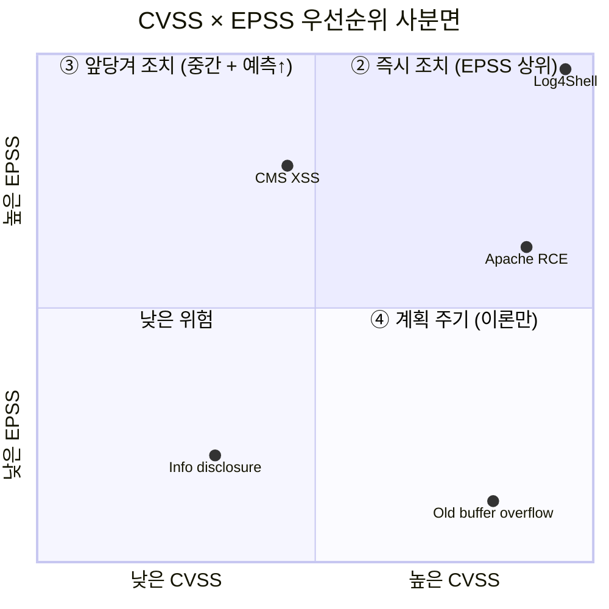
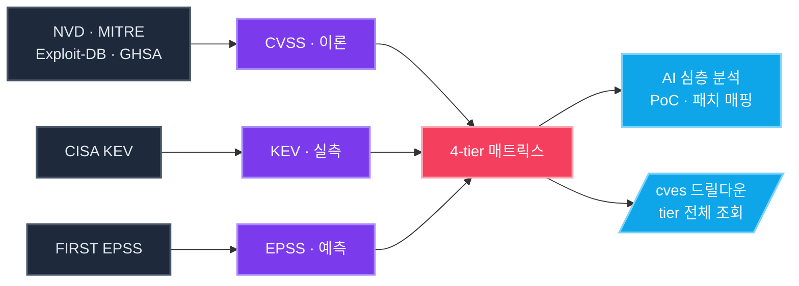
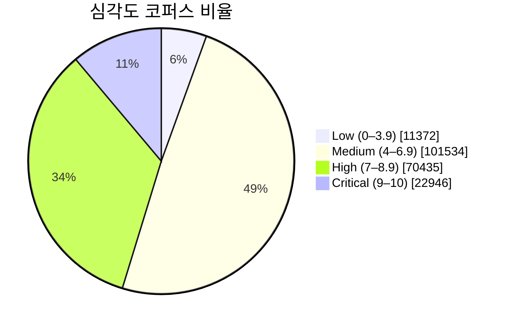
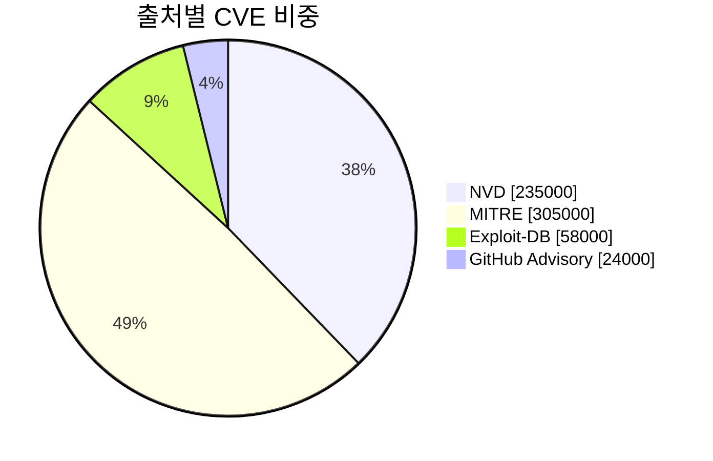
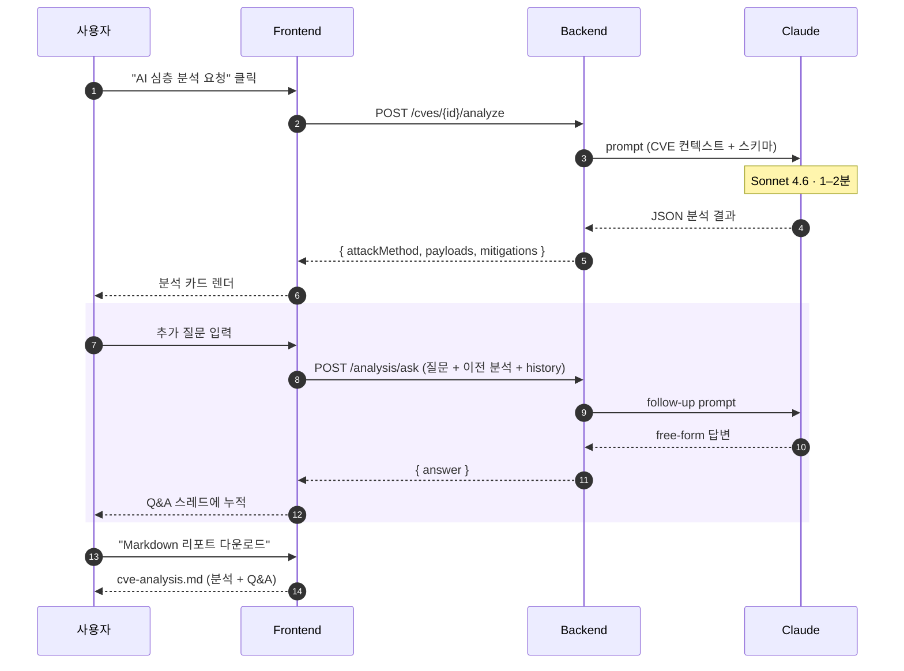
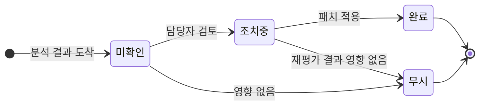

<div align="center">

<br/>

```
   __                                __
  / /__  ___  ___ / /_ ____ ___  / /
 /  '_/ / -_)(_-</ __// __// -_)/ /
/_/\_\  \__//___/\__//_/   \__//_/
```

### 무엇부터 패치할지 알려주는 CVE 인텔리전스 플랫폼

> **모든 것을 동시에 막을 수는 없습니다.**
> 심각도가 아니라 *실제 위협*을 기준으로.

<br/>

[](./LICENSE)
[](https://nextjs.org/)
[](https://fastapi.tiangolo.com/)
[](https://www.postgresql.org/)
[](https://www.anthropic.com/)

<br/>

[**빠른 시작**](#-빠른-시작) ·
[기능](#-기능) ·
[API](#-api) ·
[개발](#-개발-환경) ·
[라이선스](#-라이선스)

</div>

<br/>

---

## ◆ At a glance

<table>
<tr>
<td align="center" width="20%">

### **6**
<sub>**데이터 소스**</sub>

<sub>NVD · MITRE · EDB<br/>GHSA · KEV · EPSS</sub>

</td>
<td align="center" width="20%">

### **200K+**
<sub>**누적 CVE**</sub>

<sub>실시간 증분 수집<br/>+ 일별 EPSS 갱신</sub>

</td>
<td align="center" width="20%">

### **3**
<sub>**위협 신호**</sub>

<sub>CVSS · EPSS · KEV<br/>합성 우선순위</sub>

</td>
<td align="center" width="20%">

### **3**
<sub>**Claude 모델**</sub>

<sub>Haiku · Sonnet · Opus<br/>10s ~ 4분</sub>

</td>
<td align="center" width="20%">

### **1 줄**
<sub>**배포 명령**</sub>

<sub>`docker compose up`<br/>한 줄로 전체 기동</sub>

</td>
</tr>
</table>

---

## ◆ 세 가지 위협 신호

<table>
<tr>
<td width="33%" align="center" valign="top">

```
┌─────────────┐
│    CVSS     │
│   0 ─ 10    │
└─────────────┘
```

#### **이론적 심각도**

`이 취약점은 얼마나 심각한가`

<sub>출처: NVD · MITRE</sub>

</td>
<td width="33%" align="center" valign="top">

```
┌─────────────┐
│    EPSS     │
│   0.0 ─ 1   │
└─────────────┘
```

#### **예측 확률**

`30일 내 악용될 가능성`

<sub>출처: FIRST.org (일 1회)</sub>

</td>
<td width="34%" align="center" valign="top">

```
┌─────────────┐
│     KEV     │
│   실측 ●    │
└─────────────┘
```

#### **관측된 사실**

`이미 실제로 악용되고 있는가`

<sub>출처: CISA (시간 단위)</sub>

</td>
</tr>
</table>

---

## ◆ 패치 우선순위 매트릭스

세 신호를 합쳐 **4-tier**로 — 행 클릭 시 `/cves?priority=<tier>` 전체 목록으로 드릴다운.



> **KEV 등재**(실측 악용)는 위치와 무관하게 **`①` 최우선** — 매트릭스 위에 별도 띠로 배치됩니다.

<table>
<tr>
<th align="center" width="90">Tier</th>
<th>기준</th>
<th>조치</th>
<th align="right">컬러</th>
</tr>
<tr>
<td align="center"><h3><code>①</code></h3></td>
<td><b>KEV 등재</b></td>
<td>실측된 악용 — <b>최우선 패치</b></td>
<td align="right"><sub><code>rose</code></sub></td>
</tr>
<tr>
<td align="center"><h3><code>②</code></h3></td>
<td><b>EPSS 상위</b> + 외부 접점</td>
<td>30일 내 악용 예측 — <b>즉시 조치</b></td>
<td align="right"><sub><code>amber</code></sub></td>
</tr>
<tr>
<td align="center"><h3><code>③</code></h3></td>
<td><b>CVSS 중간</b> + EPSS 높음</td>
<td>이론은 낮아도 터질 가능성 — <b>앞당겨 조치</b></td>
<td align="right"><sub><code>violet</code></sub></td>
</tr>
<tr>
<td align="center"><h3><code>④</code></h3></td>
<td><b>CVSS 높음</b> + EPSS 낮음</td>
<td>이론 심각도만 — <b>계획된 패치 주기</b></td>
<td align="right"><sub><code>sky</code></sub></td>
</tr>
</table>

---

## ◆ 빠른 시작

```bash
git clone https://github.com/mimonimo/Kestrel.git
cd Kestrel
docker compose up -d --build
```

<table>
<tr>
<td align="center" width="50%">

**Frontend**

<http://localhost:3000>

</td>
<td align="center" width="50%">

**Backend**

<http://localhost:8000/api/v1/health>

</td>
</tr>
</table>

<details>
<summary><b>첫 사용 흐름</b></summary>

```
STEP 01 — Claude 연동 활성화
   /settings → Claude 연동 → OAuth 로그인 → 모델 선택

STEP 02 — 자산 등록 (선택)
   /settings → 내 자산 → 사용 중인 벤더·제품 입력

STEP 03 — 외부 키 등록 (선택, 권장)
   /settings → NVD API 키 / GitHub PAT 등록 → 수집 속도 ↑

STEP 04 — MITRE 전체 백필 (최초 1회)
   /settings → MITRE 전체 백필 (약 30분 소요)
```

</details>

<sub>요구사항: Docker 24+ · 4GB RAM · 10GB 디스크 (MITRE 백필 시 +5GB)</sub>

---

## ◆ 데이터 흐름



---

## ◆ 코퍼스 현황

<table>
<tr>
<td width="50%" valign="top">

#### CVSS 점수 분포



</td>
<td width="50%" valign="top">

#### 데이터 소스 점유



</td>
</tr>
</table>

#### CVSS 10-bin 히스토그램 (실측치)

```
0–1  │ ▏                                                89건
1–2  │ ▎                                               681건
2–3  │ ▊                                             3,757건
3–4  │ █▍                                            6,868건
4–5  │ ███▋                                         27,175건
5–6  │ █████                                        36,643건
6–7  │ █████▏                                       37,761건  ← 중앙값 6.7
7–8  │ ██████▋                                      48,674건
8–9  │ ███                                          21,803건
9–10 │ ███▏          rose · KEV 후보군 다수          22,962건  ← p90 9.1
       └─────────────────────────────────────────────
       평균 6.62 · 중앙값 6.7 · 상위 10% 9.1
```

---

## ◆ 미리보기

```
┌──────────────────────────────────────────────────────────────────────┐
│  Kestrel             [대시보드][취약점][AI 분석][커뮤니티]   [⟳ 동기화]│
├──────────────────────────────────────────────────────────────────────┤
│                                                                      │
│  ┌──── 수집 분포 ────┐  ┌──── 신규 CVE 추이 (30일) ────────────┐   │
│  │   Critical 22.9K  │  │ ▁▂▃▅▇▆▇▅▃▂▁▂▃▅▆▇▇▆▅▃▂▃▅▆▇▆▅▃ │   │
│  │   High      70.4K │  │  ────────────── 평균 6.62 ─────────  │   │
│  │   Medium   101.5K │  └─────────────────────────────────────┘   │
│  │   Low       11.3K │                                              │
│  └───────────────────┘  ┌──── CVSS 점수 분포 ──────────────────┐   │
│                          │ ▁▁▂▃▅▇▇▇▆▆  bin 클릭 → 드릴다운     │   │
│  ┌──── 영향 벤더 Top 10 ┐│ 평균 6.62 · 중앙 6.7 · p90 9.1     │   │
│  │ ① Microsoft  15,929 │└─────────────────────────────────────┘   │
│  │ ② Linux      14,944 │                                            │
│  │ ③ Apple       9,716 │ ┌──── 패치 우선순위 ─────────────────┐   │
│  │ ④ Oracle      9,028 │ │ ① KEV 등재          1,602 ▰▰▰▰▰▰▰ │   │
│  │ ...                 │ │ ② EPSS 상위         6,245 ▰▰▰▰▰▰▰ │   │
│  └─────────────────────┘ │ ③ CVSS 중+EPSS↑     1,197 ▰▱▱▱▱▱▱ │   │
│                          │ ④ CVSS 높음+EPSS↓  87,766 ▰▰▰▰▰▰▰ │   │
│                          └─────────────────────────────────────┘   │
│                                                                      │
└──────────────────────────────────────────────────────────────────────┘
                                                  실제 코퍼스 수치 기반
```

---

## ◆ 기능

<table>
<tr>
<td width="33%" valign="top">

### `데이터 수집`

```
NVD 2.0       │  분 단위
MITRE cve V5  │  30분 git 델타
Exploit-DB    │  시간
GitHub Advisory│  시간
CISA KEV      │  시간
FIRST EPSS    │  일 1회
```

</td>
<td width="33%" valign="top">

### `검색 & 필터`

- Meili + PG `tsvector` 폴백
- 부분 CVE-ID (`"44228"`)
- 16 vuln-type × 18 도메인
- **`priority=tier` 필터**
- URL 동기화 + cross-filter

</td>
<td width="34%" valign="top">

### `대시보드 위젯`

- 취약점 분포 (4축 파이)
- 신규 CVE 추이 (stacked area)
- 영향 벤더 Top 10
- CVSS 10-bin 히스토그램
- 최근 Critical 카드
- **패치 우선순위 매트릭스**

</td>
</tr>
<tr>
<td valign="top">

### `AI 분석`

- 심층 분석 (PoC + 패치)
- **Follow-up Q&A** 스레드
- **CVE 2–5개 패턴 비교**
- Markdown 리포트 다운로드
- 새로고침에도 진행 상태 영속

</td>
<td valign="top">

### `협업`

- 자산 등록 + CPE 매칭
- 즐겨찾기 (디바이스)
- 대응 상태 (4단계 + 메모)
- 익명 댓글 스레드
- 5탭 작업 공간

</td>
<td valign="top">

### `운영`

- Redis 슬라이딩 윈도 rate limit
- Meili 장애 → PG 자동 폴백
- 60s TTL 캐시 (insights · facets)
- Sentry · OpenTelemetry
- `scripts/update.sh` 한 줄 업데이트

</td>
</tr>
</table>

---

## ◆ AI 분석 흐름



| 모델 | 응답 | 권장 |
|---|:---:|---|
| `Haiku 4.5` | **10 – 15초** | 일상 검토 · 빠른 스크리닝 |
| `Sonnet 4.6` <sub>(기본)</sub> | **1 – 2분** | 깊이 있는 PoC + 완화 전략 |
| `Opus 4.7` | **2 – 4분** | 복잡한 다단 익스플로잇 |

#### 대응 상태 라이프사이클



---

## ◆ 왜 Kestrel 인가

<table>
<tr>
<th width="30%"></th>
<th align="center" width="35%">기존 CVE 대시보드</th>
<th align="center" width="35%"><b>Kestrel</b></th>
</tr>
<tr>
<td><b>우선순위</b></td>
<td align="center">CVSS 한 축 정렬</td>
<td align="center"><b>CVSS + EPSS + KEV 합성</b></td>
</tr>
<tr>
<td><b>실제 악용 여부</b></td>
<td align="center">별도 페이지 / 외부 링크</td>
<td align="center">KEV 신호가 매트릭스 안에 내장</td>
</tr>
<tr>
<td><b>AI 분석</b></td>
<td align="center">텍스트 요약</td>
<td align="center"><b>PoC + 패치 매핑 + Q&A + 비교</b></td>
</tr>
<tr>
<td><b>드릴다운</b></td>
<td align="center">필터 페이지 재구성 필요</td>
<td align="center">차트 클릭 → 즉시 리스트</td>
</tr>
<tr>
<td><b>배포</b></td>
<td align="center">여러 서비스 수동 설정</td>
<td align="center"><code>docker compose up</code> 한 줄</td>
</tr>
</table>

---

## ◆ 화면

<table>
<tr>
<td align="center" width="20%">

#### `/`
**대시보드**

<sub>시각화 + 우선순위</sub>

</td>
<td align="center" width="20%">

#### `/cves`
**취약점 조회**

<sub>검색 · 필터 · 리스트</sub>

</td>
<td align="center" width="20%">

#### `/cve/{id}`
**상세 + AI**

<sub>분석 · 대응 · 댓글</sub>

</td>
<td align="center" width="20%">

#### `/analysis`
**AI 작업 공간**

<sub>5탭 (분석/비교/북마크)</sub>

</td>
<td align="center" width="20%">

#### `/settings`
**설정**

<sub>키 · Claude · 자원</sub>

</td>
</tr>
</table>

---

## ◆ API

전체 스펙: <http://localhost:8000/docs>

```bash
# KEV 등재 CVE 전체
curl 'localhost:8000/api/v1/search?priority=kev&pageSize=20'

# 대시보드 위젯 데이터 한 번에
curl 'localhost:8000/api/v1/dashboard/insights' | jq

# CVE 심층 분석
curl -X POST 'localhost:8000/api/v1/cves/CVE-2021-44228/analyze'
```

<details>
<summary><b>주요 엔드포인트 (펼치기)</b></summary>

| Path | 설명 |
|---|---|
| `GET  /search?priority=<tier>` | tier 필터 검색 |
| `GET  /search/facets` | 필터 카운트 (cross-filter) |
| `GET  /cves/{id}` | CVE 상세 |
| `POST /cves/{id}/analyze` | AI 심층 분석 |
| `POST /analysis/ask` | Follow-up Q&A |
| `POST /analysis/compare` | CVE 2-5개 패턴 비교 |
| `GET  /dashboard/insights` | 위젯 데이터 묶음 |
| `GET  /dashboard/priorities` | 4-tier 매트릭스 |
| `POST /admin/refresh-priority-signals` | KEV/EPSS 즉시 갱신 |

</details>

---

## ◆ 개발 환경

```bash
# 인프라만 띄우기
docker compose up -d postgres redis meilisearch

# 백엔드
cd backend && uv sync && source .venv/bin/activate
alembic upgrade head && uv run uvicorn app.main:app --reload

# 프론트엔드 (별도 터미널)
cd frontend && npm install && npm run dev
```

<details>
<summary><b>자주 쓰는 명령</b></summary>

| 명령 | 용도 |
|---|---|
| `npx tsc --noEmit` | 프론트 타입체크 |
| `uv run pytest` | 백엔드 테스트 |
| `uv run alembic revision -m "..."` | 마이그레이션 생성 |
| `docker compose exec backend bash` | 컨테이너 셸 |
| `bash scripts/update.sh` | git pull → 빌드 → migrate → health check |

</details>

---

## ◆ Tech Stack

<table>
<tr>
<td valign="top" width="25%">

**Frontend**

```
Next.js 15
React 18
TypeScript
TanStack Query
Tailwind CSS
```

</td>
<td valign="top" width="25%">

**Backend**

```
FastAPI
SQLAlchemy 2 async
APScheduler
httpx · structlog
Alembic
```

</td>
<td valign="top" width="25%">

**데이터**

```
PostgreSQL 16
tsvector + GIN
Meilisearch
Redis
```

</td>
<td valign="top" width="25%">

**AI · 관측**

```
Claude (CLI + API)
OpenAI 호환
OpenTelemetry
Sentry
structlog JSON
```

</td>
</tr>
</table>

---

## ◆ 라이선스

[MIT](./LICENSE)

<br/>

<div align="center">

<sub>

Built with `Next.js` · `FastAPI` · `PostgreSQL` · `Meilisearch` · `Redis` · `Claude`

<br/>

★ Star this repo if you find it useful ★

</sub>

</div>
