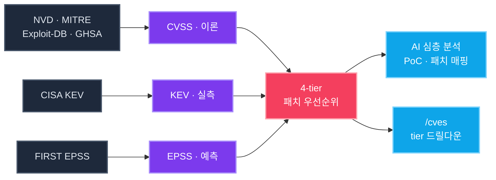
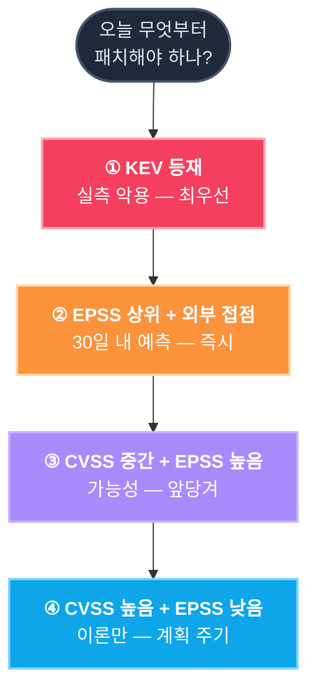

<div align="center">

<br/>

```
   ╦╔═┌─┐┌─┐┌┬┐┬─┐┌─┐┬
   ╠╩╗├┤ └─┐ │ ├┬┘├┤ │
   ╩ ╩└─┘└─┘ ┴ ┴└─└─┘┴─┘
```

### **CVE 인텔리전스 플랫폼 — 무엇부터 패치할지 알려드립니다**

> 모든 것을 동시에 막을 수는 없습니다.
> 심각도가 아니라 *실제 위협*을 기준으로.

<br/>

[](#빠른-시작)
[](#ai-분석)
[](#패치-우선순위)
[](./LICENSE)

</div>

<br/>

## 메인 대시보드

<p align="center">
  
</p>

<br/>

## 데이터 흐름



<br/>

## 패치 우선순위



<br/>

## AI 분석 흐름

```mermaid
flowchart LR
    classDef user fill:#1e293b,stroke:#475569,color:#e2e8f0,stroke-width:2px
    classDef api fill:#7c3aed,stroke:#a78bfa,color:#fff,stroke-width:2px
    classDef ai fill:#f43f5e,stroke:#fda4af,color:#fff,stroke-width:2px
    classDef out fill:#0ea5e9,stroke:#7dd3fc,color:#fff,stroke-width:2px

    U1[CVE 상세<br/>분석 요청]:::user
    A1[POST<br/>/cves/id/analyze]:::api
    C1[Claude<br/>Sonnet 4.6]:::ai
    O1[공격 · 페이로드<br/>패치 매핑]:::out

    U2[추가 질문<br/>스레드]:::user
    A2[POST<br/>/analysis/ask]:::api
    C2[Claude<br/>follow-up]:::ai
    O2[Q&A 누적]:::out

    O3[Markdown<br/>리포트]:::out

    U1 --> A1 --> C1 --> O1
    O1 --> U2 --> A2 --> C2 --> O2
    O2 --> O3
```



<br/>

## 페이지

<table>
<tr>
<td width="50%" align="center">

#### `/cves` 취약점 조회


</td>
<td width="50%" align="center">

#### `/cve/{id}` 상세 + AI 분석


</td>
</tr>
<tr>
<td width="50%" align="center">

#### `/analysis` AI 작업 공간


</td>
<td width="50%" align="center">

#### `/settings` 설정


</td>
</tr>
</table>

<br/>

## 빠른 시작

```bash
git clone https://github.com/mimonimo/Kestrel.git
cd Kestrel
docker compose up -d --build
```

Frontend → <http://localhost:3000>  ·  Backend → <http://localhost:8000>

<br/>

<div align="center">

[MIT](./LICENSE) · <sub>Built with `Next.js` · `FastAPI` · `PostgreSQL` · `Claude`</sub>

</div>
